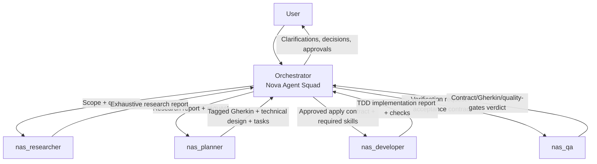

# ☄️ Nova Agent Squad (NAS) 🚀

A production-ready, multi-platform multi-agent system that reduces hallucinations
through strict role separation, explicit authorization gates, and a
contract-driven, SDD-inspired workflow.

> **Five agents. One source of truth. Explicit authorization at every step.**

## Install

You need a POSIX shell, `git`, and [`bun`](https://bun.sh) on your `PATH`. NAS
**does not auto-install bun** — install it once and you're set.

```bash
git clone https://github.com/GabrielMartinMoran/nova-agent-squad.git
cd nova-agent-squad
./install.sh          # default target: opencode
```

That's it. `./install.sh` bootstraps a fresh install for the canonical
**opencode** target. It delegates to `nas install --target=opencode`, so the
install path is the same as the CLI.

Want a different target? Pass it explicitly:

```bash
./install.sh --target=cursor
```

The full supported matrix (OpenCode, Cursor, Claude Code, Codex, Gemini CLI,
Kiro, VS Code, …) is documented in
[docs/installation-matrix.md](docs/installation-matrix.md).

## Quick Start

After `./install.sh`, your NAS agents are installed under
`~/.config/opencode/agents/`. Verify and inspect them:

```bash
nas doctor           # preconditions + manifest + source routes — all green?
nas validate         # agent files have valid frontmatter + structure
nas agents           # read-only summary of configured models per agent
nas skills           # read-only summary of permission.skill rules
```

Optional, but recommended: open `~/.config/opencode/opencode.json` and set
`default_agent` to `Nova Agent Squad` so the orchestrator is the first thing
you talk to. NAS **does not auto-edit this file** — see
[Configuration](#configuration) below.

## Updating

Stay on the current upstream branch:

```bash
nas update                    # git pull (current upstream branch)
nas update --rebuild          # pull, then `nas build --target=opencode`
nas update --reinstall        # pull, then `nas install --target=opencode`
nas update --check            # show the plan, do nothing
```

`nas update` is a **local checkout helper**. It runs `git pull --ff-only`
against whatever branch you're on. It does **not** implement release-based
updater logic (no GitHub release fetches, no version pins, no tarballs).
If you want to track a specific tag or release, do it with `git` directly.

## Usage

When you start NAS on your selected platform runtime, you'll be working with
the Nova Agent Squad orchestrator. Just describe what you want to build:

1. **Describe your feature** — the orchestrator analyzes and asks clarifying
   questions (only for scope changes or critical assumptions).
2. **Research** — Researcher exhaustively investigates the codebase and
   external sources.
3. **Plan** — Planner designs the implementation strategy and produces tagged
   Gherkin specs.
4. **Approve or refine** — you can modify scope, add constraints, or request
   alternatives.
5. **Authorize implementation** — when ready, say "yes" to apply.
6. **QA validates** — after implementation, QA verifies against specs.
   QA is mandatory and automatic. You will not be asked.

### Example Workflow

```
You: I want to add user authentication to my API

Orchestrator: Let me clarify a few things:
- What authentication method? (JWT, session, OAuth?)
- Which API endpoints need protection?
- Do you have existing user models?

You: JWT tokens, /api/users and /api/orders, yes User model exists

[Orchestrator delegates to Researcher...]
[Researcher produces exhaustive research report...]
[Orchestrator delegates to Planner...]
[Planner designs strategy and produces Gherkin specs...]
[Orchestrator presents plan...]

Orchestrator: Implementation plan is ready. Do you want me to apply it now?

You: Yes

[Orchestrator delegates to Developer...]
[Developer implements with TDD...]
[QA validates implementation...]
```

## Configuration

The default agent can be set to `Nova Agent Squad` in your selected runtime
configuration. OpenCode remains the primary GA example, but the same
orchestration flow applies to other supported platforms in the installation
matrix.

To set or change it on OpenCode, edit `~/.config/opencode/opencode.json`:

```json
{
  "default_agent": "Nova Agent Squad"
}
```

To switch back to your platform default agent, remove or change the
`default_agent` field. NAS never writes to this file for you.

### Inspecting configured models

NAS ships a read-only summary view over the current OpenCode model overrides.
Both surfaces print the same card-per-agent output (visible name,
model/variant/reasoning effort, override/default state indicator, and a
human-friendly model-capability guidance line; `default` for unset fields):

```bash
# Bare `nas agents` defaults to the read-only summary view
nas agents

# Explicit subcommand, identical output
nas agents list

# Force plain output (color is also auto-disabled on non-TTY and when
# the NO_COLOR env var is set to any non-empty value)
nas agents list --plain
nas agents --plain
```

Sample card (when a TTY is detected and color is allowed):

```
● nas_developer            · override
Model:             anthropic/claude-sonnet-4-6
Variant:           high
Reasoning effort:  default
Guidance:          heavy model recommended

○ nas_qa                   · default
Model:             default
Reasoning effort:  default
Guidance:          lighter model sufficient
```

This reads `~/.config/opencode/opencode.json` and never modifies it. To change
a model, use the interactive wizard:

```bash
nas agents setup
```

### Inspecting and managing skill policies

NAS ships a top-level `nas skills` surface for the OpenCode `permission.skill`
block. It is the canonical way to view, add, remove, or clear skill policy
rules for **NAS agents only**. The CLI never writes to top-level
`permission.skill` (which OpenCode inherits for every agent, including
non-NAS ones — out of scope for NAS).

Bare `nas skills` and `nas skills list` are byte-identical (read-only):

```bash
# Read-only summary: one card per NAS agent
nas skills
nas skills list

# Force plain output (color is also auto-disabled on non-TTY and when
# NO_COLOR is set)
nas skills list --plain
nas skills --plain

# Skip the live `opencode debug skill` reference list (CI / piped scripts)
nas skills list --skip-discovery

# Interactive wizard (Add | Remove | Clear)
nas skills setup

# Non-interactive:
nas skills add <pattern> <action> [--scope all-nas|agent] [--agent <name>]
nas skills remove <pattern> [--scope all-nas|agent] [--agent <name>]
nas skills clear [--scope all-nas|agent|all] [--agent <name>]
```

The two scopes the CLI manages:

- `--scope all-nas` (default for `add` / `remove`): fan out the rule to
  every canonical NAS agent as a per-agent block.
- `--scope agent --agent <name>`: apply the rule to a single NAS agent
  only.

Actions: `allow`, `deny`, `ask`. Patterns use native OpenCode wildcards
(`*`, `?`) — NAS does not invent its own matcher, so the rules you write
are the rules OpenCode resolves.

Examples:

```bash
# Deny the docs-writer skill for every NAS agent (the broad scope)
nas skills add docs-writer deny

# Per-agent: deny git-* for nas_developer only
nas skills add 'git-*' deny --scope agent --agent nas_developer

# Remove a rule from every NAS agent
nas skills remove docs-writer

# Clear a single NAS agent's policies
nas skills clear --scope agent --agent nas_developer

# Clear every NAS agent's policies (default for `nas skills clear`)
nas skills clear
```

The source of truth is `~/.config/opencode/opencode.json`. A timestamped
backup is created before every write, matching the `nas agents setup` policy.

## Multi-platform installation (generated templates)

NAS keeps **OpenCode** as the primary GA runtime and ships distribution
templates for other approved targets:

- OpenCode
- Cursor
- Cursor CLI Agent
- Claude Code
- Codex
- Gemini CLI
- Kiro
- VS Code

See the full matrix (status, limitations, and template paths) in
[docs/installation-matrix.md](docs/installation-matrix.md).

Centralized source/build/install:

- Canonical source: `src/agents/`
- Platform templates: `src/templates/platforms/`
- Target map + destinations: `config/platforms.manifest`
- Generated outputs: `dist/platforms/<target>/...`

Build all targets:

```bash
nas build
```

Install one target:

```bash
# Canonical OpenCode install path (~/.config/opencode/agents)
nas install --target=opencode

# Safe dry-run with custom destination root
nas install --target=cursor --dry-run --destdir=/tmp/nas-install
```

You can list available distribution templates with:

```bash
ls dist/platforms/
```

### Manual Installation

If you prefer to install manually:

```bash
nas build --target=opencode
cp -r dist/platforms/opencode/agents/* ~/.config/opencode/agents/

# Verify agents are detected
opencode --list-agents
```

- Gemini CLI remains **Experimental** and requires
  `experimental.enableAgents=true`.
- Kiro CLI supports subagents with runtime subagent tool limitations.

---

## Maintenance

The sections below describe how NAS works under the hood. They're here for
maintainers and contributors — not required reading for daily usage.

### Why Nova Agent Squad?

AI coding assistants are powerful but prone to hallucinations, scope drift,
and unauthorized modifications. NAS addresses these issues through:

- **Zero Unauthorized Changes**: Default to planning mode; implementation
  only after explicit user approval.
- **Role Separation**: Orchestrator (manager), Researcher (investigator),
  Planner (architect), Developer (implementer), QA (validator).
- **Formal Specifications**: Gherkin scenarios with tags as the source of
  truth.
- **Anti-Hallucination Guards**: Three-layer validation (Orchestrator
  assumptions, Developer pre-flight, QA verification).
- **Skill-Aware Workflow**: Automatically discovers and assigns relevant
  skills per task.

### Architecture



#### Coordination policy

- Subagents are coordinated by the orchestrator.
- Scope/contract decisions and conflicts are escalated back to the
  orchestrator.
- The architecture does **not** assume guaranteed direct
  subagent-to-subagent interaction; orchestrator mediation is the default
  coordination path.

#### Agents

| Agent | Mode | Role |
|-------|------|------|
| `Nova Agent Squad` | primary | Orchestrator: discovers installed skills, assigns required skills to subagents, coordinates workflow, escalates decisions, never performs implementation edits |
| `nas_researcher` | subagent | Research: exhaustive investigation of codebase, documentation, and external sources. Produces comprehensive research reports |
| `nas_planner` | subagent | Planner: designs implementation strategy, produces tagged Gherkin scenarios and technical design using SDD methodology |
| `nas_developer` | subagent | Developer: executes TDD (Red→Green→Refactor) and implements only within explicitly approved apply contract scope |
| `nas_qa` | subagent | QA: verifies implementation against approved contract + tagged Gherkin + quality gates (tests/lint/checks) |

### Features

#### Operational Handoff Policy

NAS subagents `nas_researcher`, `nas_planner`, `nas_developer`, and `nas_qa`
use condition-based handoff triggers. Handoff is used when there is
**blocked, at risk, or insufficient progress**.

When a handoff is required, agents provide a structured **handoff** block
compatible with existing XML contracts, including:

- `current_progress`
- `remaining_work`
- `risks`
- `recommendation: [CONTINUE | DO_NOT_CONTINUE]`
- `question_for_user` (when blocked/missing info)

#### 1. Planning-First Default

Every feature request starts in planning mode. The orchestrator will:

1. Clarify ambiguities
2. Discover available skills
3. Delegate to researcher for exhaustive investigation
4. Build the Skill Assignment Contract — which skills are relevant, which
   subagent needs them — before delegating to nas_planner
5. Delegate to planner for implementation strategy and Gherkin specs
6. Present the plan for approval, including a delegation plan with subagent
   order and exact skills
7. **Ask**: "Implementation plan is ready. Do you want me to apply it now?"
8. Never delegate to `nas_developer` until the plan has been presented and
   explicitly approved
9. After implementation, delegate to `nas_qa` automatically before any
   completion update

Planning uses a hybrid confirmation policy: confirm only scope changes or
critical assumptions, and do not request confirmation for minor
analysis/spec steps. Do not ask whether QA should run. QA is mandatory and
automatic after implementation.

#### 2. Authorization Gates

- **Assumption Confirmation**: If the orchestrator infers any default, it
  must ask the user before proceeding
- **Apply Authorization**: Each feature/scope requires explicit approval;
  prior approvals do not auto-apply to new changes
- **Scope Change Rule**: The orchestrator must ask for explicit confirmation
  when scope changes from the approved contract
- **Developer Pre-Flight**: Developer validates authorization metadata
  before editing any file
- **Critical Assumption Rule**: The orchestrator must confirm any critical
  assumption before delegating implementation
- **QA Verification**: QA confirms authorization was properly obtained
- **Developer Gate**: Never delegate to `nas_developer` before the user
  explicitly approves the presented plan
- **Auto-QA Gate**: After any implementation, `nas_qa` runs before
  completion is reported

#### 3. Tagged Gherkin Specifications

All specifications are written in Gherkin format with tags:

```gherkin
@critical @api
Feature: User Authentication
  Scenario: Successful login with valid credentials
    Given the user is on the login page
    When they enter valid username and password
    Then they should be redirected to the dashboard
```

Repository Gherkin persistence follows an orchestrator-controlled contract.
The planner is the only agent allowed to author or modify repository
`.feature` files. Developer and QA consume persisted Gherkin read-only, and
QA remains mandatory before completion.

For OpenCode, planner write permissions use `permission.edit` with a
`*.feature` allowlist. Do not use `permission.write`.

- `when: always` => planner writes/updates repo feature files on each planning/replanning pass
- `when: on_done` => planner writes/updates repo feature files once the plan is finalized/approved for implementation, before developer execution
- `when: always` is the lightweight mode for persisted pre-implementation review artifacts.
- `when: on_done` is approval-gated and does NOT persist repo `.feature` files before implementation approval.
- `when: never` => no repo writes; Gherkin stays in delegation/output only
- `format: merged` => persisted files are full canonical `.feature` files for developer and QA consumption
- `format: delta` => reserved/experimental unless separately contracted

#### 4. Skill Discovery & Assignment

The orchestrator automatically:

1. Discovers installed skills from repo-local and runtime/global sources
2. Builds the Skill Assignment Contract — which skills are relevant, which
   subagent needs them — before delegating to `nas_planner`
3. Assigns and passes exact approved skills to each subagent
4. Echoes those exact approved skills in delegation prompts and handoffs
5. Blocks implementation if critical skills are missing

Skills are assigned through a task-specific skill assignment contract. The
orchestrator discovers relevant skills, gets them approved for the current
task, and passes the exact approved skills to each subagent. It does not
keep permanent named-skill defaults.

#### 5. Memory Integration

NAS supports persistent memory for decision tracking:

- **Mind** (MCP): https://github.com/GabrielMartinMoran/mind
- **OpenSpec** (MCP)
- **Engram** (MCP)
- **claude-mem** (MCP)
- **Stateless** only when no memory backend is available

If any memory backend is configured/available, agents MUST use it and MUST NOT fall back to stateless.

#### 6. Project Configuration

Every NAS project must define `.agents/nas.config.yaml` before normal
workflow starts. The config is the canonical source for memory bootstrap,
Gherkin persistence, and config mutation policy.

```yaml
version: "1.1"

memory:
  enabled: true
  provider: mind

mind_spaces:
  project_space:
    enabled: true
    name: "projects/<repo-name>"
    description: "Project context, decisions, architecture, and session checkpoints"

gherkin:
  enabled: true
  storage_path: "specs/features"
  persist_to_repo:
    when: "on_done"
    format: "merged"
  include:
    - "product/*"
    - "application/*"
  exclude:
    - "researcher/*"
    - "sandbox/*"

sdd:
  enabled: true
  change_memory:
    auto_create: true
  delta:
    removal_policy: "remove"
    resolve_on: "on_done"
  memory_tracking: true

config_policy:
  require_confirmation: true
```

The orchestrator decides whether repository Gherkin persistence happens via
`gherkin.persist_to_repo`.

On startup, NAS checks for this file before any normal workflow. If it is
missing, the orchestrator halts normal workflow, asks for authorization to
create it, and refuses to proceed without it.

Any config change requires explicit user confirmation and is delegated to
`nas_developer`.

When delegating runtime config, pass `version` plus only the enabled
`memory`, `mind_spaces`, and `gherkin` blocks. Do not pass disabled config
blocks unless the task is config editing.

### Project Structure

```
nova-agent-squad/
├── nas                           # Root shell launcher (sources scripts/lib/find-bun.sh)
├── install.sh                    # Bootstrap installer (default target: opencode)
├── src/
│   ├── agents/                   # Canonical NAS source-of-truth
│   ├── cli/                      # CLI implementation (citty-based)
│   │   ├── commands/             # Per-command implementations (build, install, …)
│   │   ├── lib/                  # Shared libraries (manifest, model discovery, …)
│   │   └── templates/            # Build-time Eta templates (caveman, dev shared)
│   └── templates/
│       └── platforms/            # Per-target distribution templates
├── scripts/
│   └── lib/
│       └── find-bun.sh           # Shared bun-detection helper
├── config/
│   └── platforms.manifest        # Target kind/source/dist/install mapping
├── dist/
│   └── platforms/                # Generated artifacts (not primary source)
├── docs/
│   ├── architecture.md           # Detailed architecture docs
│   ├── AGENTS.md                 # Agent versioning guide
│   └── installation-matrix.md    # Platform support matrix
├── tests/
│   ├── unit/                     # bun:test unit tests
│   ├── integration/              # bun:test CLI integration tests
│   └── *.sh                      # Contract tests run by `nas test`
├── README.md
├── CHANGELOG.md
├── CONTRIBUTING.md
└── LICENSE
```

## Documentation

- [Architecture Details](docs/architecture.md) — Deep dive on agent
  contracts, permissions, and workflows.
- [Agent Versioning](docs/AGENTS.md) — How to maintain and version the
  agents.
- [Installation Matrix](docs/installation-matrix.md) — Platform support
  status and limitations.

## Credits

Nova Agent Squad uses [Mind](https://github.com/GabrielMartinMoran/mind) for
persistent memory integration. Mind is a powerful memory system for
developers and AI agents, providing structured storage, full-text search,
and MCP integration.

## License

MIT License — see [LICENSE](LICENSE) file for details.

## Contributing

Contributions are welcome! Please read [CONTRIBUTING.md](CONTRIBUTING.md)
for guidelines.

---

Built with a contract-driven, SDD-inspired multi-agent workflow. Eliminate
hallucinations. Ship with confidence.
