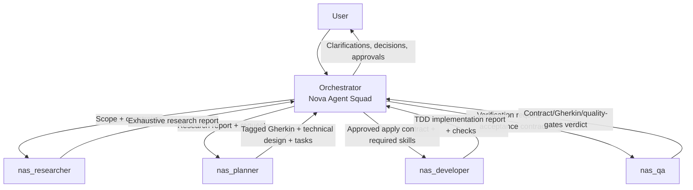

# ☄️ Nova Agent Squad (NAS) 🚀

A production-ready, multi-platform multi-agent system that reduces hallucinations through strict role separation, explicit authorization gates, and a contract-driven, SDD-inspired workflow.

## Overview

Nova Agent Squad (NAS) is a five-agent architecture for reliable, auditable software delivery. It enforces planning-first behavior, requires explicit user authorization before any file modification, and validates implementation against approved contracts and tagged Gherkin scenarios.

## Why Nova Agent Squad?

AI coding assistants are powerful but prone to hallucinations, scope drift, and unauthorized modifications. NAS addresses these issues through:

- **Zero Unauthorized Changes**: Default to planning mode; implementation only after explicit user approval
- **Role Separation**: Orchestrator (manager), Researcher (investigator), Planner (architect), Developer (implementer), QA (validator)
- **Formal Specifications**: Gherkin scenarios with tags as the source of truth
- **Anti-Hallucination Guards**: Three-layer validation (Orchestrator assumptions, Developer pre-flight, QA verification)
- **Skill-Aware Workflow**: Automatically discovers and assigns relevant skills per task

## Architecture



### Coordination policy

- Subagents are coordinated by the orchestrator.
- Scope/contract decisions and conflicts are escalated back to the orchestrator.
- The architecture does **not** assume guaranteed direct subagent-to-subagent interaction; orchestrator mediation is the default coordination path.

### Agents

| Agent | Mode | Role |
|-------|------|------|
| `Nova Agent Squad` | primary | Orchestrator: discovers installed skills, assigns required skills to subagents, coordinates workflow, escalates decisions, never performs implementation edits |
| `nas_researcher` | subagent | Research: exhaustive investigation of codebase, documentation, and external sources. Produces comprehensive research reports |
| `nas_planner` | subagent | Planner: designs implementation strategy, produces tagged Gherkin scenarios and technical design using SDD methodology |
| `nas_developer` | subagent | Developer: executes TDD (Red→Green→Refactor) and implements only within explicitly approved apply contract scope |
| `nas_qa` | subagent | QA: verifies implementation against approved contract + tagged Gherkin + quality gates (tests/lint/checks) |

## Features

### Operational Handoff Policy

NAS subagents `nas_researcher`, `nas_planner`, `nas_developer`, and `nas_qa` use condition-based handoff triggers.
Handoff is used when there is **blocked, at risk, or insufficient progress**.

When a handoff is required, agents provide a structured **handoff** block compatible with existing XML contracts, including:
- `current_progress`
- `remaining_work`
- `risks`
- `recommendation: [CONTINUE | DO_NOT_CONTINUE]`
- `question_for_user` (when blocked/missing info)

### 1. Planning-First Default

Every feature request starts in planning mode. The orchestrator will:
1. Clarify ambiguities
2. Discover available skills
3. Delegate to researcher for exhaustive investigation
4. Build the Skill Assignment Contract — which skills are relevant, which subagent needs them — before delegating to nas_planner
5. Delegate to planner for implementation strategy and Gherkin specs
6. Present the plan for approval, including a delegation plan with subagent order and exact skills
7. **Ask**: "Implementation plan is ready. Do you want me to apply it now?"
8. Never delegate to `nas_developer` until the plan has been presented and explicitly approved
9. After implementation, delegate to `nas_qa` automatically before any completion update

Planning uses a hybrid confirmation policy: confirm only scope changes or critical assumptions, and do not request confirmation for minor analysis/spec steps.
Do not ask whether QA should run. QA is mandatory and automatic after implementation.

### 2. Authorization Gates

- **Assumption Confirmation**: If the orchestrator infers any default, it must ask the user before proceeding
- **Apply Authorization**: Each feature/scope requires explicit approval; prior approvals do not auto-apply to new changes
- **Scope Change Rule**: The orchestrator must ask for explicit confirmation when scope changes from the approved contract
- **Developer Pre-Flight**: Developer validates authorization metadata before editing any file
- **Critical Assumption Rule**: The orchestrator must confirm any critical assumption before delegating implementation
- **QA Verification**: QA confirms authorization was properly obtained
- **Developer Gate**: Never delegate to `nas_developer` before the user explicitly approves the presented plan
- **Auto-QA Gate**: After any implementation, `nas_qa` runs before completion is reported

### 3. Tagged Gherkin Specifications

All specifications are written in Gherkin format with tags:

```gherkin
@critical @api
Feature: User Authentication
  Scenario: Successful login with valid credentials
    Given the user is on the login page
    When they enter valid username and password
    Then they should be redirected to the dashboard
```

Repository Gherkin persistence follows an orchestrator-controlled contract.
The planner is the only agent allowed to author or modify repository
`.feature` files. Developer and QA consume persisted Gherkin read-only, and QA
remains mandatory before completion.

For OpenCode, planner write permissions use `permission.edit` with a
`*.feature` allowlist. Do not use `permission.write`.

- `when: always` => planner writes/updates repo feature files on each planning/replanning pass
- `when: on_done` => planner writes/updates repo feature files once the plan is finalized/approved for implementation, before developer execution
- `when: always` is the lightweight mode for persisted pre-implementation review artifacts.
- `when: on_done` is approval-gated and does NOT persist repo `.feature` files before implementation approval.
- `when: never` => no repo writes; Gherkin stays in delegation/output only
- `format: merged` => persisted files are full canonical `.feature` files for developer and QA consumption
- `format: delta` => reserved/experimental unless separately contracted

### 4. Skill Discovery & Assignment

The orchestrator automatically:
1. Discovers installed skills from repo-local and runtime/global sources
2. Builds the Skill Assignment Contract — which skills are relevant, which subagent needs them — before delegating to `nas_planner`
3. Assigns and passes exact approved skills to each subagent
4. Echoes those exact approved skills in delegation prompts and handoffs
5. Blocks implementation if critical skills are missing

Skills are assigned through a task-specific skill assignment contract.
The orchestrator discovers relevant skills, gets them approved for the current
task, and passes the exact approved skills to each subagent. It does not keep
permanent named-skill defaults.

### 5. Memory Integration

NAS supports persistent memory for decision tracking:
- **Mind** (MCP): https://github.com/GabrielMartinMoran/mind
- **OpenSpec** (MCP)
- **Engram** (MCP)
- **claude-mem** (MCP)
- **Stateless** only when no memory backend is available

If any memory backend is configured/available, agents MUST use it and MUST NOT fall back to stateless.

### 6. Project Configuration

Every NAS project must define `.agents/nas.config.yaml` before normal
workflow starts. The config is the canonical source for memory bootstrap,
Gherkin persistence, and config mutation policy.

```yaml
version: "1.1"

memory:
  enabled: true
  provider: mind

mind_spaces:
  project_space:
    enabled: true
    name: "projects/<repo-name>"
    description: "Project context, decisions, architecture, and session checkpoints"

gherkin:
  enabled: true
  storage_path: "specs/features"
  persist_to_repo:
    when: "on_done"
    format: "merged"
  include:
    - "product/*"
    - "application/*"
  exclude:
    - "researcher/*"
    - "sandbox/*"

sdd:
  enabled: true
  change_memory:
    auto_create: true
  delta:
    removal_policy: "remove"
    resolve_on: "on_done"
  memory_tracking: true

config_policy:
  require_confirmation: true
```

The orchestrator decides whether repository Gherkin persistence happens via `gherkin.persist_to_repo`.

On startup, NAS checks for this file before any normal workflow. If it is
missing, the orchestrator halts normal workflow, asks for authorization to
create it, and refuses to proceed without it.

Any config change requires explicit user confirmation and is delegated to
`nas_developer`.

When delegating runtime config, pass `version` plus only the enabled
`memory`, `mind_spaces`, and `gherkin` blocks. Do not pass disabled config
blocks unless the task is config editing.

## Quick Start

### Prerequisites

- Git configured
- One supported runtime from the platform matrix (OpenCode recommended)

### Installation

```bash
# Clone this repository
git clone git@github.com:GabrielMartinMoran/nova-agent-squad.git

# Install agents to your global OpenCode config (canonical target)
cd nova-agent-squad
make install TARGET=opencode
```

### Centralized source/build/install

NAS now uses a **single source-of-truth** and generates platform artifacts from it:

- Canonical source: `src/agents/`
- Platform templates: `src/templates/platforms/`
- Target map + destinations: `config/platforms.manifest`
- Generated outputs: `dist/platforms/<target>/...`

Build all targets:

```bash
make build TARGET=all
```

Install one target (build + install):

```bash
# Canonical OpenCode install path (~/.config/opencode/agents)
make install TARGET=opencode

# Safe dry-run with custom destination root
make install TARGET=cursor DRY_RUN=1 DESTDIR=/tmp/nas-install
```

### Multi-platform installation (generated templates)

NAS keeps **OpenCode** as the primary GA runtime and ships distribution templates for other approved targets:

- OpenCode
- Cursor
- Cursor CLI Agent
- Claude Code
- Codex
- Gemini CLI
- Kiro
- VS Code

See the full matrix (status, limitations, and template paths) in [docs/installation-matrix.md](docs/installation-matrix.md).

Legacy per-platform source artifacts were removed to avoid double source. Use generated outputs in `dist/platforms/`.

- Gemini CLI remains **Experimental** and requires `experimental.enableAgents=true`.
- Kiro CLI supports subagents with runtime subagent tool limitations.

You can list available distribution templates with:

```bash
make list-platform-templates
```

### Manual Installation

If you prefer to install manually:

```bash
# Build and copy generated OpenCode artifacts manually
make build TARGET=opencode
cp -r dist/platforms/opencode/agents/* ~/.config/opencode/agents/

# Verify agents are detected
opencode --list-agents
```

### Configuration

The default agent can be set to `Nova Agent Squad` in your selected runtime configuration.
OpenCode remains the primary GA example, but the same orchestration flow applies to other supported platforms in the installation matrix.

To switch back to your platform default agent:

For OpenCode, edit `~/.config/opencode/opencode.json` and remove or change the `default_agent` field.

## Usage

When you start NAS on your selected platform runtime, you'll be working with the Nova Agent Squad orchestrator. Just describe what you want to build:

1. **Describe your feature** - The orchestrator will analyze and ask clarifying questions
2. **Research** - Researcher exhaustively investigates the codebase and external sources
3. **Plan** - Planner designs the implementation strategy and produces Gherkin specs
4. **Approve or refine** - You can modify scope, add constraints, or request alternatives
5. **Authorize implementation** - When ready, say "yes" to apply
6. **QA validates** - After implementation, QA verifies against specs

### Example Workflow

```
You: I want to add user authentication to my API

Orchestrator: Let me clarify a few things:
- What authentication method? (JWT, session, OAuth?)
- Which API endpoints need protection?
- Do you have existing user models?

You: JWT tokens, /api/users and /api/orders, yes User model exists

[Orchestrator delegates to Researcher...]
[Researcher produces exhaustive research report...]
[Orchestrator delegates to Planner...]
[Planner designs strategy and produces Gherkin specs...]
[Orchestrator presents plan...]

Orchestrator: Implementation plan is ready. Do you want me to apply it now?

You: Yes

[Orchestrator delegates to Developer...]
[Developer implements with TDD...]
[QA validates implementation...]
```

## Project Structure

```
nova-agent-squad/
├── src/
│   ├── agents/                        # Canonical NAS source-of-truth
│   └── templates/
│       └── platforms/                 # Per-target templates
├── config/
│   └── platforms.manifest             # Target kind/source/dist/install mapping
├── scripts/
│   ├── build.sh                       # dist artifact generation by target
│   └── install.sh                     # target install with dry-run support
├── dist/
│   └── platforms/                     # Generated artifacts (not primary source)
├── .opencode/
│   └── agents/                        # Synced OpenCode runtime copy
├── docs/
│   ├── architecture.md                # Detailed architecture docs
│   └── AGENTS.md                      # Agent versioning guide
├── Makefile                           # Installation commands
├── README.md                          # This file
├── LICENSE                           # MIT License
├── CONTRIBUTING.md                   # Contribution guidelines
└── CHANGELOG.md                      # Version history
```

## Documentation

- [Architecture Details](docs/architecture.md) - Deep dive into agent contracts, permissions, and workflows
- [Agent Versioning](docs/AGENTS.md) - How to maintain and version the agents

## Credits

Nova Agent Squad uses [Mind](https://github.com/GabrielMartinMoran/mind) for persistent memory integration. Mind is a powerful memory system for developers and AI agents, providing structured storage, full-text search, and MCP integration.

## License

MIT License - see [LICENSE](LICENSE) file for details.

## Contributing

Contributions are welcome! Please read [CONTRIBUTING.md](CONTRIBUTING.md) for guidelines.

---

Built with a contract-driven, SDD-inspired multi-agent workflow. Eliminate hallucinations. Ship with confidence.
